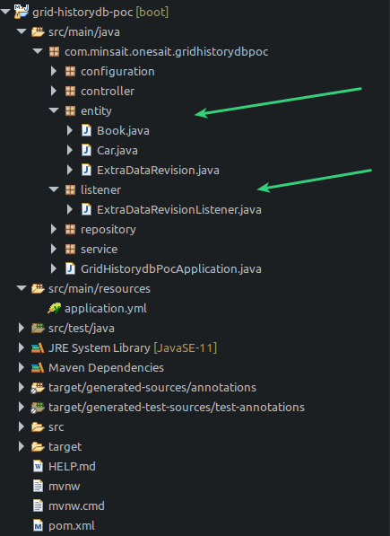
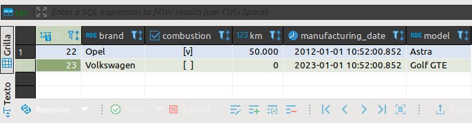
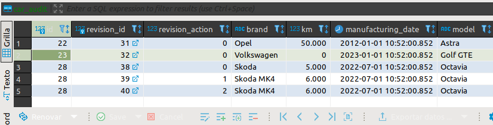
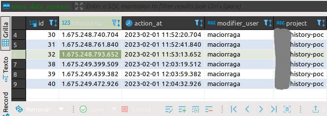

# POC-HISTORYDB

## Introducción

En este documento vamos a abordar el cómo crear un histórico de base de datos. Concrétamente, veremos cómo generar dinámicamente desde el código en sí del proyecto una tabla hermana de las entidades que queramos auditar. Para ello, utilizaremos **hibernate envers** el cuál nos proporciona los recursos necesarios para cumplir la necesidad que se nos requiere.

La presentación y paquetería tendría que ser de la siguiente manera:



## Contenido de la POC

Para esta POC, en el propio repositorio se crea un proyecto de Spring, en el cuál partiendo de tener unas entidades **Car**, según los cambios que se hagan en ellas vía Api Rest, tendrá que quedar un rastro del qué se ha hecho (crear, modificar y borrar) y, además, tendremos la capacidad de añadir campos extra como pueden ser el usuario que ha hecho los cambios, fecha... etc. 
También haremos uso de **Keycloak** para poder securizar la misma y posteriormente guardar el usuario que ha hecho cambios en nuestras entidades.

Se disponibiliza un swagger para poder realizar estos cambios de manera fácil y sencilla. la url es: http://localhost:8080/poc-historydb/swagger-ui.html

Por ejemplo, cuando realizamos una nueva inserción para la entidad **Car**, la cual tiene una tabla **car**, automáticamente se generará una tabla en base de datos llamada **car_audit** en la cuál se guardará una nueva fila en la cual se registran los campos que hayamos marcado como **@Auditable**. A su vez, gracias a envers, también se generará otra tabla **común a todas las entidades auditadas** en la cual podremos guardar los campos que queramos. Por ejemplo, para esta poc, en esta tabla extra de datos guardaremos **el usuario que ha hecho el cambio, la fecha en la que se ha hecho el cambio, y el proyecto desde que se ha hecho el cambio**.

La base de datos que emplearemos en esta prueba es **Postgres**.

- Dentro de la carpeta src/resources/dockers se adjuntan un docker-compose de una **base de datos postgres**, y otro archivo docker-compose con una **imagen de keycloak**. Para poder llevar a cabo las pruebas, además de lanzar ambos docker-compose, habrá que acceder a keycloak, **crear un Realm llamado RealmDev**, **un client llamado login** y **algún usuario**. (Se puede cambiar los nombres del realm y client siempre y cuando se adapte la configuración del application.yml).
- La base de datos por defecto al lanzar el docker-compose será **postgres**.

## Funcionamiento detallado de ENVERS

Para este caso, vamos a hacer una **inserción**, una **modificación** y un **borrado** sobre la entidad **Car**.
  - **Damos de alta** un registro para la entidad **Car**
  - **Modificamos** el registro que acabamos de dar de alta.
  - Por último, **borramos** el registro que anteriormente hemos creado y modificado.

  El resultado de lo anteriormente detallado, en base de datos es el siguiente:

  ### Tabla car
  - En esta tabla, al ser un borrado la última acción llevada a cabo, no quedará constancia del registro.

  

  ### Tabla car_audit

  - Esta tabla contendrá un **histórico** de registros de y de cambios llevados a cabo de una entidad.
  - Como podemos observar en la tabla car_audit, idetificamos el tipo de acción que se ha llevado a cabo en el registro en base los siguiente dígitos:

      **0** -> Creación de un registro.

      **1** -> Modificación de un registro.

      **2** -> Borrado de un registro.

  

  ### Tabla extra_data_revision

  - Esta tabla contendrá los campos extra que hemos decidido añadir a nuestra auditoría de datos. Cabe recordar que esta tabla no es exclusiva de la tabla **car** sino que es común a todas las entidades auditadas.
  - El campo **id** de esta tabla está relacionado con el campos **revision_id** de la tabla **car_audit**. De esta manera es cómo sabemos quien, cuándo y qué proyecto ha sido el encargado de llevar a cabo la acción sobre la entidad.

  

## Dependencia a importar

```
<dependency>
    <groupId>org.springframework.data</groupId>
    <artifactId>spring-data-envers</artifactId>
</dependency>
```

## Propiedades a definir en application.yml
```
spring:
  datasource:
    url: jdbc:postgresql://server:port/dbname
    username: userdb
    password: passdb
  jpa:
    database-platform: org.hibernate.dialect.PostgreSQLDialect
    hibernate:
      ddl-auto: update                                 # ddl-auto update para que cree automáticamente las tablas  
    properties:
      org:
        hibernate:
          envers:
            audit_table_suffix: _AUDIT                 # Sufijo de la tabla creada
            revision_field_name: REVISION_ID           # Campo creado en la tabla para identificar el cambio
            revision_type_field_name: REVISION_ACTION  # Campo creado en la tabla que indicará creacion/borrado/modificacion
            store_data_at_delete: true                 # Activado el auditar datos borrados
```

| :exclamation:  IMPORTANTE         |
|:----------------------------------|
| Si por necesidades del proyecto, no se puede habilitar la propiedad **ddl-auto:update** la creación de las tablas que se mostraron en apartados anteriores tendrá que hacerse de manera manual. Para ello, se puede seguir la guía que se encuentra en la documentación oficial en el siguiente enlace: 
https://docs.jboss.org/hibernate/orm/current/userguide/html_single/Hibernate_User_Guide.html#envers

<details>
  <summary>El ejemplo para auditar en este caso la entidad **Car SIN USAR DDL-AUTO: UPDATE** Sería el siguiente</summary>
  
  ```
  CREATE TABLE public.car_audit (     -- Sufijo _AUDIT definido en application.yml (audit_table_suffix)
    id int8 NOT NULL,               -- Campo obligatorio Envers
    revision_id int4 NOT NULL,      -- Campo obligatorio Envers (Definido en application.yml - revision_field_name)
    revision_action int2 NULL,      -- Campo obligatorio Envers (Definido en application.yml - revision_type_field_name)
    brand varchar(255) NULL,        
    km numeric(19, 2) NULL,
    manufacturing_date timestamp NULL,
    model varchar(255) NULL,
    CONSTRAINT car_audit_pkey PRIMARY KEY (id, revision_id)  -- PK Obligatoria Envers
  );

  -- Si esta tabla ya está creada, no lazar este create ya que es común a las entidades auditadas
  -- El nombre de la tabla viene dado según nombremos la entidad para campos personalizados que creamos en código. En nuestro caso ExtraDataRevision.java
  CREATE TABLE public.extra_data_revision ( 
    id int4 NOT NULL,               -- Campo obligatorio Envers
    "timestamp" int8 NOT NULL,      -- Campo obligatorio Envers
    action_at timestamp NULL,       
    modifier_user varchar(255) NULL,
    project varchar(255) NULL,
    CONSTRAINT extra_data_revision_pkey PRIMARY KEY (id)    -- PK Obligatoria Envers
  );
  ```
</details>

<details>
  <summary>Un ejemplo para hacerlo para bases de datos MSSQL podría ser el siguiente</summary>
  
  ```
  CREATE TABLE core.extra_data_revision(
      [id] [int] NOT NULL,
      [timestamp] [bigint] NOT NULL,
      [action_at] [datetime2](7) NULL,
      [modifier_user] [varchar](255) NULL,
      [project] [varchar](255) NULL,
  PRIMARY KEY CLUSTERED
  (
      [id] ASC
  )WITH (PAD_INDEX = OFF, STATISTICS_NORECOMPUTE = OFF, IGNORE_DUP_KEY = OFF, ALLOW_ROW_LOCKS = ON, ALLOW_PAGE_LOCKS = ON, OPTIMIZE_FOR_SEQUENTIAL_KEY = OFF) ON [PRIMARY]
  ) ON [PRIMARY]
  
  CREATE TABLE [core].[users_audit](
      [id] [bigint] NOT NULL,
      [revision_id] [int] NOT NULL,
      [revision_action] [smallint] NULL,
      [admin] [bit] NULL,
      [code] [varchar](100) NULL,
      [active] [bit] NULL,
      [delete_date] [datetime2](7) NULL,
      [email] [varchar](100) NULL,
      [user_zones] [varchar](255) NULL,  PRIMARY KEY CLUSTERED
  (
      [id] ASC,
      [revision_id] ASC
  )WITH (PAD_INDEX = OFF, STATISTICS_NORECOMPUTE = OFF, IGNORE_DUP_KEY = OFF, ALLOW_ROW_LOCKS = ON, ALLOW_PAGE_LOCKS = ON, OPTIMIZE_FOR_SEQUENTIAL_KEY = OFF) ON [PRIMARY]
  ) ON [PRIMARY]
  
  
  ALTER TABLE [core].[users_audit]  WITH CHECK ADD  CONSTRAINT [FKgp9e7tgjb1g5stfwgquin6gab] FOREIGN KEY([revision_id])
  REFERENCES [core].[extra_data_revision] ([id])
  
  
  ALTER TABLE [core].[users_audit] CHECK CONSTRAINT [FKgp9e7tgjb1g5stfwgquin6gab]
  ```
</details>


## Uso de hibernate envers

### Entidad auditada
- Como podemos observar, tendremos que marcar la clase con la anotación **@Auditable**. Esto automáticamente hará que se genere una nueva tabla en base de datos que se llamará **car_audit**. Cabe apuntar que, si solo queremos auditar uno, o unos pocos campos de la entidad, **podemos utilizar la etiqueta @Auditable a nivel de propiedad en vez de clase**
- Agregaremos también la anotación **@EntityListeners(AuditingEntityListener.class)** tal cual. 
- También tendremos que tener en cuenta que podemos marcar las propiedades que no queremos que sean auditadas. Para ello, haremos uso de la etiqueta **@NotAudited**. En estos casos es **MUY RECOMENDABLE marcar como @NotAudited las propiedades que sirvan como relaciones con otras entidades**.

    ```
    @Data
    @Entity
    @Audited
    @EntityListeners(AuditingEntityListener.class)
    public class Car {

        @Id
        @GeneratedValue(strategy = GenerationType.IDENTITY, generator = "order_seq_gen")
        @SequenceGenerator(name = "order_seq_gen", sequenceName ="order_id_seq", allocationSize = 1)
        @Schema(accessMode = AccessMode.READ_ONLY)
        private Long id;
        
        private String brand;
        
        private String model;
        
        @NotAudited
        private Boolean combustion;
        
        private BigDecimal km;
        
        private LocalDateTime manufacturingDate;   

    }
    ```

### Creación de entidad para campos propios

Esta clase servirá para añadir los campos extra que queramos que sean guardados además de los anteriores auditados. 
- Al crear esta entidad, se generará en base de datos una tabla que se llamará **extra_data_revision** en la que se almacenarán estos datos y se relacionarán de manera que, por ejemplo, para la tabla **car_audit**, existirá un campo llamado **revision_id** el cuál será coincidente con el **id** del registro de la tabla **extra_data_revision**. 
- Esta tabla **extra_data_revision** será común a todas las entidades auditadas.

```
@Entity
@RevisionEntity(ExtraDataRevisionListener.class)
public class ExtraDataRevision extends DefaultRevisionEntity {

	private static final long serialVersionUID = 6752442448430489553L;

	private String modifierUser;        // Campo que almacenará el usuario que ha hecho el cambio.

	private LocalDateTime actionAt;     // Campo que guardará la fecha de cuándo se ha hecho el cambio.
	
	private String project;             // Campo encargado de guardar el proyecto desde el que se ha hecho el cambio.
	
	// Getters and setters...

}
```

### Dar valor a los campos propios del punto anterior

- Llegados a este punto, tendremos que dar valor a los campos que hemos creado en el apartado anterior. Es decir, en el punto anterior hemos "fijado" los nuevos campos que van a aser añadidos como campos extra a auditar. Ahora, tendremos que indicar cómo asignar valor a esos campos en cada cambios que se produzca en la entidad o entidades auditadas.
- Para este ejemplo, añadiremos como campos extras **el usuario que ha hecho el cambio (sirviéndonos de keycloak como identity server), la fecha en la que se ha hecho el cambio, y por último, el proyecto desde el que se ha hecho el cambio**.
```
public class ExtraDataRevisionListener implements RevisionListener{

	@Override
	public void newRevision(Object revisionEntity) {
		ExtraDataRevision rev = (ExtraDataRevision) revisionEntity;
		rev.setModifierUser(getUserName());
		rev.setActionAt(LocalDateTime.now());
		rev.setProject("history-poc");
	}
	
    // Método encargado de extraer el usuario de Keycloak. Este método es mejor tener en una clase de utilidad, la cual esté
    // anotada como @UtilityClass para no tener la necesidad de instanciarla.
	private String getUserName() {
		String userName = "User not found";
		Authentication authentication = SecurityContextHolder.getContext().getAuthentication();
		if (authentication != null && authentication.getPrincipal() instanceof KeycloakPrincipal) {
			@SuppressWarnings("unchecked")
			KeycloakPrincipal<KeycloakSecurityContext> kp = (KeycloakPrincipal<KeycloakSecurityContext>) authentication
					.getPrincipal();
			userName = kp.getKeycloakSecurityContext().getToken().getPreferredUsername();
		}
		return userName;
	}
	
}
```